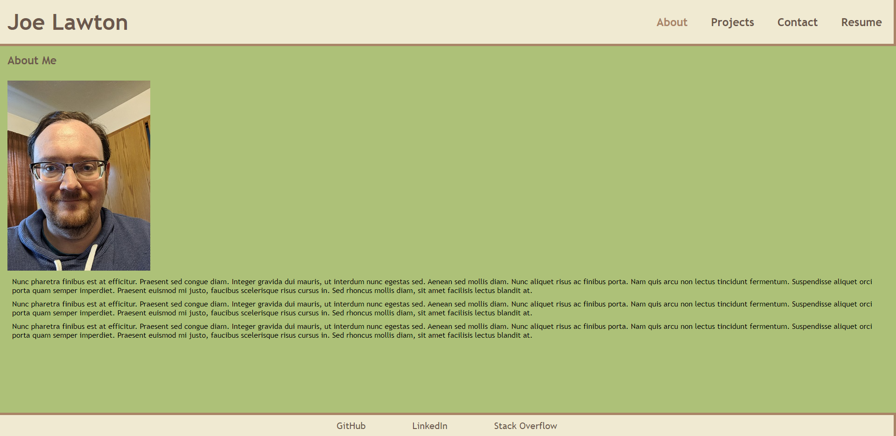

  # Joe Lawton's Portfolio

  

  ## Description
  This is a portfolio I wrote using React to showcase my full stack development skills and some of the projects I have worked on.

  ## Link
  [My Portfolio]()

  

  ## Table of Contents
  * [Description](#description)
  * [Link](#link)
  * [Usage](#usage)
  * [License](#license)
  * [Contribution](#contribute)
  * [Questions](#questions)

  ## Usage
  You can view my portfolio at the Link listed above.

  ## License
  This software is licensed under the [MIT license](https://choosealicense.com/licenses/mit/).

  ## Contribution
  This project follows the guidelines of the [Contributor Covenant](https://www.contributor-covenant.org/version/2/0/code_of_conduct/). If you are interested in contributing, please contact me at my email in the Questions section of this README.

  ## Questions
  If you have any questions about this project, you can email me at joe.lawton@outlook.com.
  For other projects, check out my [GitHub](https://github.com/jdlawton).
